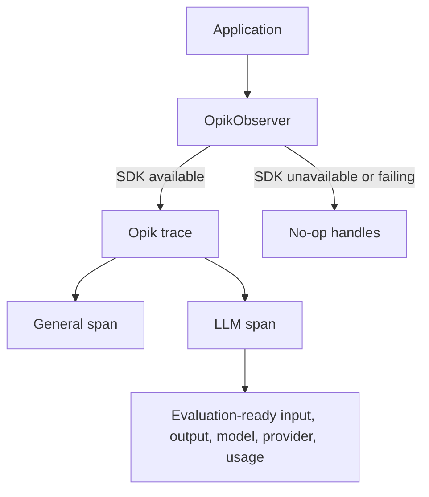

# LLM Evaluation and Observability

A small, public reference implementation for production-oriented LLM observability and evaluation with [Opik](https://www.comet.com/docs/opik/). The project is intentionally vendor-conscious: application code depends on a narrow observer boundary, while Opik remains an optional integration.

This foundation contains tracing only. It does not include an application workflow, API, UI, database, RAG pipeline, evaluators, experiments, authentication, or deployment configuration.

## Setup

Python 3.11 or newer is required.

```bash
python -m venv .venv
source .venv/bin/activate
python -m pip install -e '.[dev]'
cp .env.example .env
pytest
```

Opik is an optional dependency for consumers that only need the observer interface:

```bash
python -m pip install -e '.[opik]'
```

## Observer architecture

`OpikObserver` is the only module that knows about the Opik SDK. It lazily creates an Opik client when the package is available and otherwise returns inert trace/span handles. SDK creation, recording, and completion errors are swallowed so observability cannot break application behavior.



Trace and span handles are context managers. Completion metadata is merged with metadata supplied at creation before it is sent to Opik. LLM-specific `operation` and `prompt_version` values are stored as span metadata because the current Opik child-span API has no dedicated parameters for them. Model, provider, token usage, input, and output use native span fields.

LLM payload capture is controlled by `OPIK_CAPTURE_LLM_IO` and defaults to `true`. Set it to `false` to omit LLM input and output while preserving operational metadata and token counts. The observer reads only this named boolean setting; it never enumerates or logs environment variables.

## Minimal example

```python
from app.llm.models import TokenUsage
from app.observability import OpikObserver

observer = OpikObserver()

with observer.trace("Investigation", input={"case": "example"}) as trace:
    with trace.span("prepare-context", input={"source_count": 2}):
        pass

    with trace.llm_span(
        "draft-answer",
        input={"messages": [{"role": "user", "content": "Summarize the evidence."}]},
        model="example-model",
        provider="example-provider",
        operation="chat",
        prompt_version="1.0",
    ) as llm_span:
        llm_span.complete(
            output={"answer": "The evidence is consistent."},
            usage=TokenUsage(input_tokens=12, output_tokens=6),
        )
```

This creates:

```text
Investigation trace
├── prepare-context (general span)
└── draft-answer (LLM span)
```

## Local integration test

Start Opik locally, configure `OPIK_URL_OVERRIDE` if needed, and explicitly opt in:

```bash
OPIK_RUN_INTEGRATION_TESTS=true pytest -m integration
```

The integration test is skipped by default. Unit tests use a recording fake and do not require Opik.
