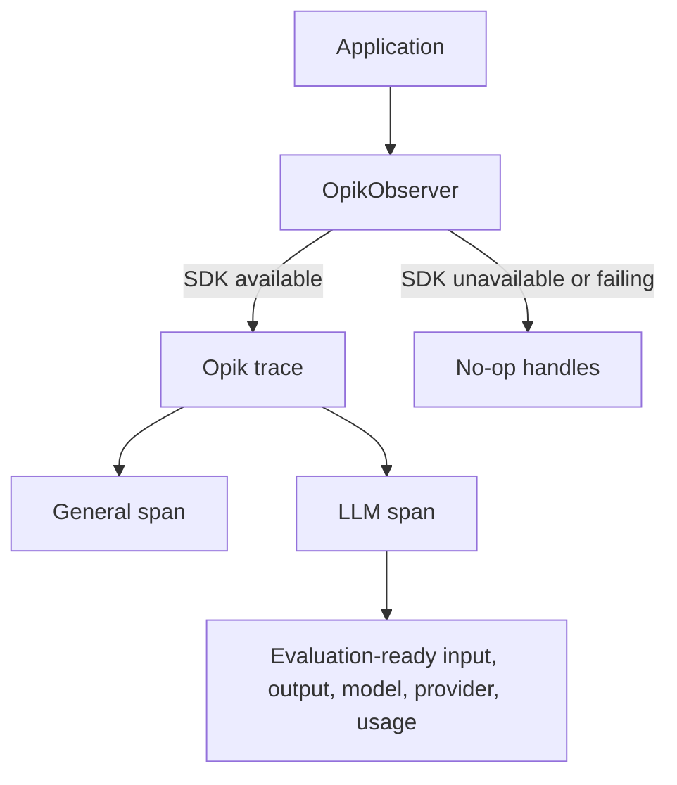

# LLM Evaluation and Observability

A small, public reference implementation for production-oriented LLM observability and evaluation with [Opik](https://www.comet.com/docs/opik/). The project is intentionally vendor-conscious: application code depends on a narrow observer boundary, while Opik remains an optional integration.

This reference now contains tracing, deterministic evaluation, and isolated feedback-score publication. It does not include an API, UI, database, RAG pipeline, LLM-as-judge evaluators, experiments, authentication, or deployment configuration.

## Setup

Python 3.11 or newer is required.

```bash
python -m venv .venv
source .venv/bin/activate
python -m pip install -e '.[dev]'
cp .env.example .env
pytest
```

Opik is an optional dependency for consumers that only need the observer interface:

```bash
python -m pip install -e '.[opik]'
```

## Observer architecture

`OpikObserver` is the only module that knows about the Opik SDK. It lazily creates an Opik client when the package is available and otherwise returns inert trace/span handles. SDK creation, recording, and completion errors are swallowed so observability cannot break application behavior.



Trace and span handles are context managers. Completion metadata is merged with metadata supplied at creation before it is sent to Opik. LLM-specific `operation` and `prompt_version` values are stored as span metadata because the current Opik child-span API has no dedicated parameters for them. Model, provider, token usage, input, and output use native span fields.

LLM payload capture is controlled by `OPIK_CAPTURE_LLM_IO`. The observer defaults to capture for backward compatibility, while the runnable example defaults to the safer opt-in behavior. Set it to `true` for the example to record its synthetic input and output. Operational metadata and token counts are retained when capture is disabled. The observer reads only this named boolean setting; it never enumerates or logs environment variables.

See [the quickstart](docs/quickstart.md) for the synthetic end-to-end investigation.

## Minimal example

```python
from app.llm.models import TokenUsage
from app.observability import OpikObserver

observer = OpikObserver()

with observer.trace("Investigation", input={"case": "example"}) as trace:
    with trace.span("prepare-context", input={"source_count": 2}):
        pass

    with trace.llm_span(
        "draft-answer",
        input={"messages": [{"role": "user", "content": "Summarize the evidence."}]},
        model="example-model",
        provider="example-provider",
        operation="chat",
        prompt_version="1.0",
    ) as llm_span:
        llm_span.complete(
            output={"answer": "The evidence is consistent."},
            usage=TokenUsage(input_tokens=12, output_tokens=6),
        )
```

This creates:

```text
Investigation trace
├── prepare-context (general span)
└── draft-answer (LLM span)
```

## Local integration test

Start Opik locally, configure `OPIK_URL_OVERRIDE` if needed, and explicitly opt in:

```bash
OPIK_ENABLED=true OPIK_CAPTURE_LLM_IO=true pytest -m integration
```

The integration test is skipped by default. Unit tests use a recording fake and do not require Opik.

## Deterministic evaluation

The vendor-neutral evaluation engine scores structured cases on fact coverage, evidence attribution, and human alignment. It is pure Python, deterministic, and independent of Opik or external model APIs.

```python
from evaluation.cases import CASE_001
from evaluation.evaluate import evaluate_case

results = evaluate_case(CASE_001)
```

CASE-001 produces exact scores of `0.80` for fact coverage, `0.50` for evidence attribution, and `0.60` for human alignment. See [the evaluation strategy](docs/evaluation-strategy.md) for formulas, exclusions, and known limitations.

## Evaluation publication

Opik is the current backend for publishing deterministic results as trace feedback scores. Publication is isolated in `app/observability/opik_evaluation.py`; the evaluation engine itself does not depend on or import Opik.

With local Opik configured, run the complete trace, evaluation, and publication flow:

```bash
python examples/publish_case_evaluation.py
```

The application trace receives `fact_coverage=0.80`, `evidence_attribution=0.50`, and `human_alignment=0.60`. The values come directly from `evaluate_case(CASE_001)`, not from constants in the publisher. Publication returns an explicit status and preserves the original evaluation results if Opik fails.

## Synthetic benchmark

The controlled benchmark expands CASE-001 into ten public-safe cases covering positive controls, missing facts, invalid citations, structurally attributed but unsupported claims, human rejection and revision, conflicting evidence, and sparse evidence. Every expected numerator, denominator, and score is checked against the unchanged deterministic engine.

```python
from evaluation.benchmark import CASES, get_case

positive_control = get_case("CASE-010")
```

Print the engine-computed score table with:

```bash
python examples/benchmark_summary.py
```

See [the benchmark design](docs/benchmark-design.md) for each case's purpose, expected results, and known metric limitations.
